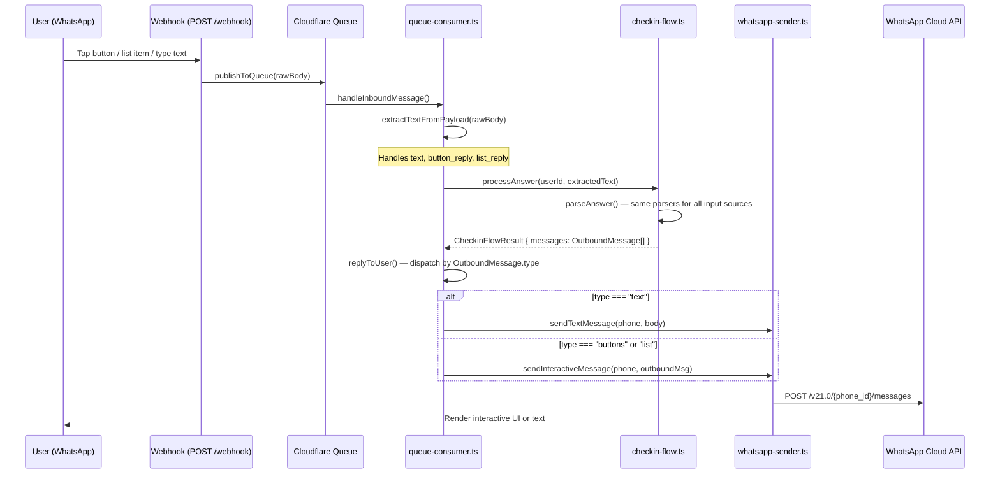
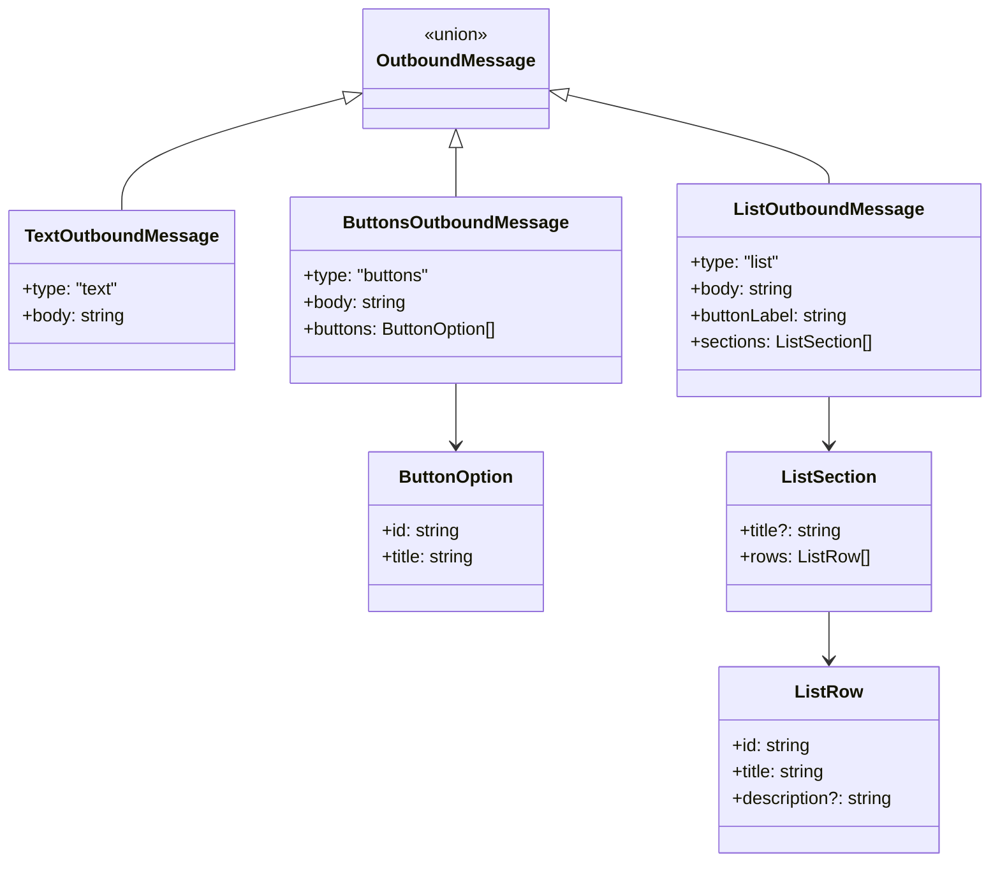

# Design Document: Interactive WhatsApp Messages

## Overview

This feature replaces plain-text question prompts in the daily check-in flow with interactive WhatsApp messages — list menus for ordinal-scale questions (0–5) and button messages for the structured medication adherence question (yes/no/partial). Numeric and text questions remain plain text since they require freeform input.

The change touches four modules along the existing message pipeline:

1. **whatsapp-sender.ts** — New `sendInteractiveMessage()` function that POSTs interactive payloads to the WhatsApp Cloud API.
2. **checkin-flow.ts** — Returns structured `OutboundMessage` objects instead of plain `string[]`, with each message tagged as `"text"`, `"buttons"`, or `"list"`.
3. **queue-consumer.ts** — `extractTextFromPayload()` extended to parse `button_reply` and `list_reply` interactive webhook payloads.
4. **queue-consumer.ts** — `replyToUser()` dispatches by `OutboundMessage.type`, calling the appropriate sender function.

Users can still type plain text even when interactive UI is shown — the existing answer parsers already handle the raw text values that interactive reply IDs map to.

### Design Rationale

- **Discriminated union for OutboundMessage**: Using a `type` discriminant (`"text" | "buttons" | "list"`) lets TypeScript narrow the payload shape at each dispatch point, preventing mismatched API calls at compile time.
- **Payload builders as pure functions**: Following the existing `buildTextMessagePayload` pattern, interactive payload builders are pure functions that return `Record<string, unknown>`. This keeps them testable without network mocks.
- **Reply ID = parseable value**: Interactive reply IDs encode the same string the user would type (e.g. `"3"` for ordinal, `"yes"` for structured). This means `extractTextFromPayload` can return the ID directly and the existing `parseOrdinalAnswer` / `parseStructuredAnswer` parsers work unchanged.
- **Backward compatibility by default**: Since `extractTextFromPayload` still handles `msg.type === "text"`, users who type instead of tapping get the same experience as before.

## Architecture



### Question Type → Message Type Mapping

| Question Type | Variable Codes | WhatsApp Message Type | Rationale |
|---|---|---|---|
| `numeric` | DAT-001 | Plain text | Freeform number input (sleep hours) |
| `ordinal` | DAT-002 – DAT-012 | List message | 6 options (0–5) fits list format (max 10 rows) |
| `structured` | DAT-013 | Button message | 3 options (Yes/No/Partial) fits button format (max 3 buttons) |
| `text` | DAT-014, DAT-015 | Plain text | Freeform text input |

## Components and Interfaces

### 1. OutboundMessage Types (`checkin-flow.ts`)

```typescript
/** Base fields shared by all outbound message types. */
interface OutboundMessageBase {
  body: string; // The question prompt or message text
}

/** A plain text message — used for numeric questions, text questions, and non-question messages. */
interface TextOutboundMessage extends OutboundMessageBase {
  type: 'text';
}

/** A button option for interactive button messages. */
interface ButtonOption {
  id: string;    // Reply ID sent back when user taps (max 256 chars)
  title: string; // Button label displayed to user (max 20 chars)
}

/** An interactive button message — used for structured questions (yes/no/partial). */
interface ButtonsOutboundMessage extends OutboundMessageBase {
  type: 'buttons';
  buttons: ButtonOption[]; // 1–3 buttons
}

/** A list row for interactive list messages. */
interface ListRow {
  id: string;          // Reply ID sent back when user taps (max 200 chars)
  title: string;       // Row label displayed to user (max 24 chars)
  description?: string; // Optional description below the title (max 72 chars)
}

/** An interactive list message — used for ordinal questions (0–5 scale). */
interface ListOutboundMessage extends OutboundMessageBase {
  type: 'list';
  buttonLabel: string;  // Label on the button that opens the list (max 20 chars)
  sections: Array<{
    title?: string;     // Optional section header
    rows: ListRow[];    // 1–10 rows per section
  }>;
}

/** Discriminated union of all outbound message types. */
type OutboundMessage = TextOutboundMessage | ButtonsOutboundMessage | ListOutboundMessage;
```

### 2. Updated CheckinFlowResult (`checkin-flow.ts`)

```typescript
/** Result returned by the flow handler to the caller. */
interface CheckinFlowResult {
  /** Response message(s) to send back to the user. */
  messages: OutboundMessage[];
  /** Whether the check-in session is now complete. */
  completed: boolean;
}
```

This replaces the current `messages: string[]` with `messages: OutboundMessage[]`.

### 3. Payload Builders (`whatsapp-sender.ts`)

Two new pure functions following the existing `buildTextMessagePayload` pattern:

```typescript
/**
 * Build a WhatsApp Cloud API interactive button message payload.
 */
function buildButtonMessagePayload(
  phoneNumber: string,
  body: string,
  buttons: ButtonOption[],
): Record<string, unknown> {
  return {
    messaging_product: 'whatsapp',
    recipient_type: 'individual',
    to: phoneNumber,
    type: 'interactive',
    interactive: {
      type: 'button',
      body: { text: body },
      action: {
        buttons: buttons.map((b) => ({
          type: 'reply',
          reply: { id: b.id, title: b.title },
        })),
      },
    },
  };
}

/**
 * Build a WhatsApp Cloud API interactive list message payload.
 */
function buildListMessagePayload(
  phoneNumber: string,
  body: string,
  buttonLabel: string,
  sections: Array<{ title?: string; rows: ListRow[] }>,
): Record<string, unknown> {
  return {
    messaging_product: 'whatsapp',
    recipient_type: 'individual',
    to: phoneNumber,
    type: 'interactive',
    interactive: {
      type: 'list',
      body: { text: body },
      action: {
        button: buttonLabel,
        sections: sections.map((s) => ({
          ...(s.title ? { title: s.title } : {}),
          rows: s.rows.map((r) => ({
            id: r.id,
            title: r.title,
            ...(r.description ? { description: r.description } : {}),
          })),
        })),
      },
    },
  };
}
```

### 4. sendInteractiveMessage (`whatsapp-sender.ts`)

```typescript
/**
 * Send an interactive message (button or list) to a WhatsApp phone number.
 * Uses the same API endpoint and error handling pattern as sendTextMessage.
 */
async function sendInteractiveMessage(
  env: WhatsAppSenderEnv,
  phoneNumber: string,
  message: ButtonsOutboundMessage | ListOutboundMessage,
): Promise<SendResult> {
  const requestBody =
    message.type === 'buttons'
      ? buildButtonMessagePayload(phoneNumber, message.body, message.buttons)
      : buildListMessagePayload(phoneNumber, message.body, message.buttonLabel, message.sections);

  // Same fetch + error handling as sendTextMessage
  // ...
}
```

### 5. Updated sendOutboundMessages (`whatsapp-sender.ts`)

A new function that replaces `sendMessages` for `OutboundMessage[]`:

```typescript
/**
 * Send an array of OutboundMessage objects, dispatching by type.
 * Sends in order. Continues on failure (logs but does not throw).
 */
async function sendOutboundMessages(
  env: WhatsAppSenderEnv,
  phoneNumber: string,
  messages: OutboundMessage[],
): Promise<SendResult[]> {
  const results: SendResult[] = [];
  for (const msg of messages) {
    let result: SendResult;
    if (msg.type === 'text') {
      result = await sendTextMessage(env, phoneNumber, msg.body);
    } else {
      result = await sendInteractiveMessage(env, phoneNumber, msg);
    }
    results.push(result);
  }
  return results;
}
```

### 6. Updated extractTextFromPayload (`queue-consumer.ts`)

```typescript
function extractTextFromPayload(rawBody: string): string | null {
  try {
    const payload = JSON.parse(rawBody);
    const msg = payload?.entry?.[0]?.changes?.[0]?.value?.messages?.[0];
    if (!msg) return null;

    // Existing: plain text messages
    if (msg.type === 'text' && typeof msg.text?.body === 'string') {
      return msg.text.body;
    }

    // New: interactive button reply
    if (msg.type === 'interactive' && msg.interactive?.button_reply?.id) {
      return msg.interactive.button_reply.id;
    }

    // New: interactive list reply
    if (msg.type === 'interactive' && msg.interactive?.list_reply?.id) {
      return msg.interactive.list_reply.id;
    }
  } catch {
    // Malformed JSON — fall through
  }
  return null;
}
```

### 7. Question-to-OutboundMessage Mapping (`checkin-flow.ts`)

A new pure function that converts a `QuestionDefinition` into the appropriate `OutboundMessage`:

```typescript
/**
 * Build an OutboundMessage for a check-in question based on its type.
 * Includes the progress indicator in the body text.
 */
function buildQuestionMessage(
  question: QuestionDefinition,
  questionIndex: number,
  totalQuestions: number,
): OutboundMessage {
  const progress = `(${questionIndex + 1}/${totalQuestions})`;
  const body = `${progress} ${question.prompt}`;

  switch (question.type) {
    case 'ordinal': {
      const min = question.scale?.min ?? 0;
      const max = question.scale?.max ?? 5;
      const rows: ListRow[] = [];
      for (let i = min; i <= max; i++) {
        let title = `${i}`;
        if (i === min && question.scale?.labels?.min) {
          title = `${i} — ${question.scale.labels.min}`;
        } else if (i === max && question.scale?.labels?.max) {
          title = `${i} — ${question.scale.labels.max}`;
        }
        rows.push({ id: String(i), title });
      }
      return {
        type: 'list',
        body,
        buttonLabel: 'Choose a value',
        sections: [{ rows }],
      };
    }

    case 'structured':
      return {
        type: 'buttons',
        body,
        buttons: [
          { id: 'yes', title: 'Yes' },
          { id: 'no', title: 'No' },
          { id: 'partial', title: 'Partial' },
        ],
      };

    case 'numeric':
    case 'text':
    default:
      return { type: 'text', body };
  }
}
```

### 8. Updated replyToUser (`queue-consumer.ts`)

```typescript
async function replyToUser(
  env: WhatsAppSenderEnv,
  phone: string,
  messages: OutboundMessage[],
  messageId: string,
): Promise<void> {
  if (messages.length === 0) return;
  const results = await sendOutboundMessages(env, phone, messages);
  const failures = results.filter((r) => !r.success);
  if (failures.length > 0) {
    console.log(JSON.stringify({
      level: 'warn',
      handler: 'inbound-message',
      messageId,
      msg: 'Some reply messages failed to send',
      failedCount: failures.length,
      totalCount: results.length,
    }));
  }
}
```

## Data Models

No database schema changes are required. The interactive message feature only affects the in-flight message format between services. All persisted data (check-in sessions in KV, symptom observations in D1) remains unchanged.

### OutboundMessage Type Hierarchy



### WhatsApp Cloud API Constraints (enforced by payload builders)

| Constraint | Limit | Enforced In |
|---|---|---|
| Buttons per message | Max 3 | `buildButtonMessagePayload` |
| Button reply.id length | Max 256 chars | `ButtonOption.id` |
| Button reply.title length | Max 20 chars | `ButtonOption.title` |
| List rows per section | Max 10 | `buildListMessagePayload` |
| List row id length | Max 200 chars | `ListRow.id` |
| List row title length | Max 24 chars | `ListRow.title` |
| List action.button length | Max 20 chars | `ListOutboundMessage.buttonLabel` |


## Correctness Properties

*A property is a characteristic or behavior that should hold true across all valid executions of a system — essentially, a formal statement about what the system should do. Properties serve as the bridge between human-readable specifications and machine-verifiable correctness guarantees.*

### Property 1: Button payload builder produces well-formed payloads

*For any* valid phone number and `ButtonsOutboundMessage` (with 1–3 buttons, each having an `id` ≤ 256 chars and `title` ≤ 20 chars), `buildButtonMessagePayload` SHALL produce a payload with `messaging_product: "whatsapp"`, `recipient_type: "individual"`, `to` matching the phone number, `type: "interactive"`, `interactive.type: "button"`, `interactive.body.text` matching the message body, and `interactive.action.buttons` containing the same number of buttons with matching `reply.id` and `reply.title` values.

**Validates: Requirements 1.1, 7.1, 7.2**

### Property 2: List payload builder produces well-formed payloads

*For any* valid phone number and `ListOutboundMessage` (with 1–10 rows per section, each row having an `id` ≤ 200 chars and `title` ≤ 24 chars, and `buttonLabel` ≤ 20 chars), `buildListMessagePayload` SHALL produce a payload with `messaging_product: "whatsapp"`, `recipient_type: "individual"`, `to` matching the phone number, `type: "interactive"`, `interactive.type: "list"`, `interactive.body.text` matching the message body, `interactive.action.button` matching the button label, and `interactive.action.sections` containing rows with matching `id` and `title` values.

**Validates: Requirements 2.1, 7.3, 7.4, 7.5**

### Property 3: All OutboundMessages have a valid type and non-empty body

*For any* `QuestionDefinition` (of any type: numeric, ordinal, structured, text) and any valid question index and total, `buildQuestionMessage` SHALL produce an `OutboundMessage` with `type` equal to `"text"`, `"buttons"`, or `"list"`, and a `body` string that is non-empty and contains the question prompt.

**Validates: Requirements 3.1**

### Property 4: Ordinal questions produce list messages with correct scale rows

*For any* ordinal `QuestionDefinition` with `scale.min` and `scale.max` (where max − min ≤ 9 to fit within the 10-row limit), `buildQuestionMessage` SHALL produce a `ListOutboundMessage` with exactly `(scale.max - scale.min + 1)` rows, where each row's `id` is the string representation of its scale value, and the first and last rows include the scale labels in their titles.

**Validates: Requirements 3.2**

### Property 5: Interactive reply extraction returns the reply ID

*For any* string `replyId`, a WhatsApp webhook payload containing `msg.type: "interactive"` with either `msg.interactive.button_reply.id` or `msg.interactive.list_reply.id` set to `replyId`, calling `extractTextFromPayload` SHALL return `replyId`.

**Validates: Requirements 4.1, 4.2**

### Property 6: Text message extraction backward compatibility

*For any* non-empty string `bodyText`, a WhatsApp webhook payload containing `msg.type: "text"` with `msg.text.body` set to `bodyText`, calling `extractTextFromPayload` SHALL return `bodyText`.

**Validates: Requirements 4.3**

### Property 7: Unsupported message types return null

*For any* WhatsApp webhook payload where `msg.type` is not `"text"` and not `"interactive"` (e.g. `"image"`, `"audio"`, `"location"`, or any arbitrary string), calling `extractTextFromPayload` SHALL return `null`.

**Validates: Requirements 4.4**

### Property 8: Outbound messages are sent in input order

*For any* array of `OutboundMessage` objects (of mixed types), `sendOutboundMessages` SHALL invoke the underlying send functions in the same order as the input array, such that the i-th send call corresponds to the i-th message in the input.

**Validates: Requirements 5.3**

### Property 9: Interactive reply IDs are accepted by existing answer parsers

*For any* ordinal scale value `v` in range `[min, max]`, `parseOrdinalAnswer(String(v), min, max)` SHALL return `v`. And for each structured reply ID in `{"yes", "no", "partial"}`, `parseStructuredAnswer(id)` SHALL return the corresponding numeric value (`1`, `0`, `0.5`). This ensures that the interactive reply IDs used as list row IDs and button IDs are valid inputs to the existing parsers.

**Validates: Requirements 6.1, 6.2**

### Property 10: Payload construction round-trip

*For any* valid `OutboundMessage` object (text, buttons, or list), constructing the WhatsApp API payload via the appropriate builder function and then extracting the body text and action metadata from the resulting payload SHALL produce values equivalent to the original `OutboundMessage` fields.

**Validates: Requirements 7.6**

## Error Handling

### WhatsApp Cloud API Errors

| Error Scenario | Handling | User Impact |
|---|---|---|
| API returns 4xx/5xx for interactive message | `sendInteractiveMessage` returns `SendResult { success: false }` with status code and error string. Logged at `warn` level. | Message not delivered; remaining messages in batch still sent. |
| Network error (fetch throws) | Caught in try/catch, returns `SendResult { success: false }` with error message. No exception propagates. | Same as above. |
| Malformed interactive payload rejected by API | API returns 400. Logged with error details. | Message not delivered. Indicates a bug in payload builder — should be caught by property tests. |

### Inbound Payload Parsing Errors

| Error Scenario | Handling | User Impact |
|---|---|---|
| Malformed JSON in webhook body | `extractTextFromPayload` catches parse error, returns `null`. | Message silently dropped (same as current behavior for non-text messages). |
| Interactive payload missing `button_reply` and `list_reply` | Falls through all conditions, returns `null`. | Message silently dropped. |
| Unknown `msg.type` value | Returns `null` (requirement 4.4). | Message silently dropped. |

### Backward Compatibility Safeguards

- If `buildQuestionMessage` encounters an unknown `QuestionType`, it falls through to the `default` case and produces a plain text message. This ensures new question types added in the future don't break the flow.
- The `replyToUser` function signature changes from `messages: string[]` to `messages: OutboundMessage[]`. All callers in `queue-consumer.ts` must be updated. Non-checkin flows (notes, injection, medication, etc.) that currently return `string[]` will need their results wrapped as `TextOutboundMessage` objects — a helper function `textMessages(strings: string[]): OutboundMessage[]` will handle this conversion.

## Testing Strategy

### Unit Tests (Vitest)

Unit tests cover specific examples, edge cases, and integration points:

- **Payload builders**: Verify `buildButtonMessagePayload` and `buildListMessagePayload` produce correct JSON structure for known inputs (DAT-013 buttons, DAT-002 list).
- **buildQuestionMessage**: Verify each question type maps to the correct `OutboundMessage` type with specific known questions from `questions.json`.
- **extractTextFromPayload**: Verify button_reply, list_reply, and text extraction with concrete webhook payloads. Verify null for unsupported types (image, audio, status updates).
- **sendInteractiveMessage**: Mock `fetch` to test success, API error, and network error paths.
- **sendOutboundMessages**: Mock senders to verify dispatch by type, ordering, and failure resilience.
- **replyToUser**: Verify it calls `sendOutboundMessages` and logs failures.
- **Non-question messages**: Verify confirmations, resumption notices, and completion summaries produce `TextOutboundMessage`.
- **Skip commands**: Verify skip still works for all question types when interactive UI is shown.
- **Structured question buttons**: Verify exactly 3 buttons with IDs "yes", "no", "partial".

### Property-Based Tests (Vitest + fast-check)

Property-based tests verify universal correctness properties across randomly generated inputs. Each property test runs a minimum of 100 iterations.

**Library**: `fast-check` (to be added as a dev dependency in `apps/worker-api/package.json`)

**Property tests to implement** (one test per correctness property):

1. **Property 1** — Generate random `ButtonsOutboundMessage` objects, verify `buildButtonMessagePayload` output structure.
   - Tag: `Feature: interactive-whatsapp-messages, Property 1: Button payload builder produces well-formed payloads`
2. **Property 2** — Generate random `ListOutboundMessage` objects, verify `buildListMessagePayload` output structure.
   - Tag: `Feature: interactive-whatsapp-messages, Property 2: List payload builder produces well-formed payloads`
3. **Property 3** — Generate random `QuestionDefinition` objects of all types, verify `buildQuestionMessage` output has valid type and non-empty body.
   - Tag: `Feature: interactive-whatsapp-messages, Property 3: All OutboundMessages have valid type and non-empty body`
4. **Property 4** — Generate random ordinal questions with varying scales, verify list row count and IDs match the scale range.
   - Tag: `Feature: interactive-whatsapp-messages, Property 4: Ordinal questions produce list messages with correct scale rows`
5. **Property 5** — Generate random reply IDs, build interactive webhook payloads, verify `extractTextFromPayload` returns the ID.
   - Tag: `Feature: interactive-whatsapp-messages, Property 5: Interactive reply extraction returns the reply ID`
6. **Property 6** — Generate random text strings, build text webhook payloads, verify `extractTextFromPayload` returns the text.
   - Tag: `Feature: interactive-whatsapp-messages, Property 6: Text message extraction backward compatibility`
7. **Property 7** — Generate random unsupported type strings, build payloads, verify `extractTextFromPayload` returns null.
   - Tag: `Feature: interactive-whatsapp-messages, Property 7: Unsupported message types return null`
8. **Property 8** — Generate random arrays of mixed `OutboundMessage` types, verify send order matches input order.
   - Tag: `Feature: interactive-whatsapp-messages, Property 8: Outbound messages sent in input order`
9. **Property 9** — Generate random ordinal values in valid ranges, verify `parseOrdinalAnswer` accepts them. Verify `parseStructuredAnswer` accepts all three button IDs.
   - Tag: `Feature: interactive-whatsapp-messages, Property 9: Interactive reply IDs accepted by existing parsers`
10. **Property 10** — Generate random `OutboundMessage` objects, build payloads, extract fields back, verify round-trip equivalence.
    - Tag: `Feature: interactive-whatsapp-messages, Property 10: Payload construction round-trip`

### Test File Organization

| File | Contents |
|---|---|
| `whatsapp-sender.test.ts` | Unit + property tests for payload builders, `sendInteractiveMessage`, `sendOutboundMessages` |
| `checkin-flow.test.ts` | Updated existing tests + new unit + property tests for `buildQuestionMessage`, `OutboundMessage` types |
| `queue-consumer.test.ts` | Updated `extractTextFromPayload` tests + property tests for interactive payload parsing |
