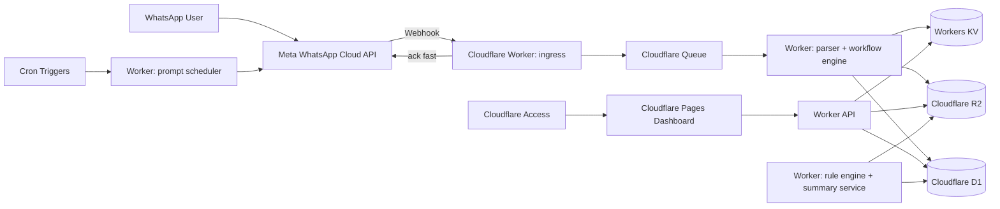
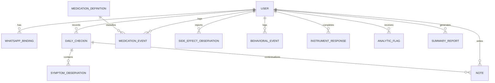

# Combined Blueprint

See README for context.

---

# 01 Requirements Document

## 1. Document purpose

This document defines the functional and non-functional requirements for a Cloudflare-hosted symptom-tracking application that uses WhatsApp as the primary interaction channel and provides a secure web dashboard for review and analysis.

## 2. Product objective

Build a low-friction system that captures structured and freeform symptom data over time, turns that data into useful trend analysis, and produces outputs that are meaningful to:
- the user
- the user's primary care doctor
- the user's therapist
- the user's psychiatrist

## 3. Product stance

### 3.1 MVP positioning
The MVP is a **personal symptom tracker with clinician-shareable exports**, not a full clinical portal.

### 3.2 Out of scope for MVP
- direct EHR integration
- automated diagnosis
- medication recommendations
- live clinician logins
- emergency/crisis response workflow
- insurance/billing workflows

## 4. Stakeholders

| Role | Need |
|---|---|
| User | Fast daily check-ins, notes, trends, useful self-observation |
| Primary care doctor | Medication tolerance, appetite/weight trend, GI side effects, adherence summary |
| Therapist | Interpersonal patterns, triggers, conflict load, emotional/behavioral patterning, notes |
| Psychiatrist | Mood instability markers, sleep changes, activation/hypomania risk indicators, adherence, side-effect timeline |

## 5. Assumptions

| ID | Assumption |
|---|---|
| ASM-001 | MVP serves a single patient account |
| ASM-002 | The patient is the only live dashboard user in MVP |
| ASM-003 | Clinicians receive exported summaries rather than real-time access |
| ASM-004 | WhatsApp Business Platform is used for messaging and webhook delivery |
| ASM-005 | Cloudflare is the primary hosting/runtime platform |
| ASM-006 | Current medication tracking must include Mounjaro at initiation-stage dosing |

## 6. Success criteria

| ID | Metric | Target |
|---|---|---|
| KPI-001 | Daily check-in completion time | <= 90 seconds median |
| KPI-002 | Daily completion rate | >= 70% of prompted days over 30 days |
| KPI-003 | Weekly note capture rate | >= 1 freeform note per week on average |
| KPI-004 | Dashboard load time | <= 2.5 sec for main views |
| KPI-005 | Report usefulness | User can export a monthly summary containing mood, sleep, meds, side effects, notes, and flags |
| KPI-006 | Trend detection value | Dashboard can identify at least 5 clinically relevant pattern types |

## 7. Symptom model

### 7.1 Daily structured measures
The MVP shall support daily capture of the following high-value variables.

| Data Item ID | Variable | Type | Cadence | Why it matters |
|---|---|---|---|---|
| DAT-001 | Sleep duration | numeric | daily | Bipolar risk marker and ADHD functioning marker |
| DAT-002 | Sleep quality | ordinal | daily | Distinguishes short but okay sleep from fractured sleep |
| DAT-003 | Mood valence | ordinal | daily | Tracks depression/elevation swing |
| DAT-004 | Energy/activation | ordinal | daily | Useful for hypomania vs exhaustion patterns |
| DAT-005 | Irritability/anger | ordinal | daily | High-value cross-diagnostic marker |
| DAT-006 | Anxiety/tension | ordinal | daily | Helps separate activation from anxiety |
| DAT-007 | Focus/attention | ordinal | daily | ADHD functioning marker |
| DAT-008 | Racing thoughts | ordinal | daily | Hypomanic activation marker |
| DAT-009 | Impulsivity/urge to act | ordinal | daily | ADHD + bipolar + behavioral risk relevance |
| DAT-010 | Risk-taking/goal-drive | ordinal | daily | Distinguishes productive activation from destabilization |
| DAT-011 | Interpersonal conflict load | ordinal | daily | Useful to therapy and behavioral pattern review |
| DAT-012 | Appetite | ordinal | daily | Important for Mounjaro and mood changes |
| DAT-013 | Medication adherence | structured boolean/event | daily | Core clinical utility |
| DAT-014 | Freeform note | text | optional daily | Captures nuance that ratings miss |

### 7.2 Event-based tracking
The MVP shall support event capture outside the daily check-in.

| Data Item ID | Event | Type |
|---|---|---|
| DAT-015 | Mounjaro injection | medication event |
| DAT-016 | Missed medication dose | medication event |
| DAT-017 | Behavioral incident | tagged event |
| DAT-018 | Conflict/escalation event | tagged event |
| DAT-019 | Substance-use event | tagged event |
| DAT-020 | Extra note/journal entry | text event |

### 7.3 Mounjaro-specific variables
The app shall specifically support Mounjaro initiation and tolerability tracking.

| Data Item ID | Variable | Type | Cadence |
|---|---|---|---|
| DAT-021 | Injection date/time | event | per injection |
| DAT-022 | Injection dose | enum/numeric | per injection |
| DAT-023 | Injection site | enum | per injection |
| DAT-024 | Nausea | ordinal | daily around injection |
| DAT-025 | Diarrhea | ordinal | daily around injection |
| DAT-026 | Vomiting | ordinal | daily around injection |
| DAT-027 | Constipation | ordinal | daily around injection |
| DAT-028 | Abdominal pain | ordinal | daily around injection |
| DAT-029 | Hydration difficulty | ordinal | daily when symptomatic |
| DAT-030 | Appetite suppression | ordinal | daily |
| DAT-031 | Weight | numeric | optional daily/weekly |
| DAT-032 | Glucose reading | numeric | optional manual entry |

### 7.4 Optional weekly instruments
The MVP should support a weekly structured mania check and configurable future instruments.

| Requirement ID | Requirement |
|---|---|
| FR-INST-001 | System shall support a weekly mania screener flow |
| FR-INST-002 | System shall store instrument name, version, date, raw responses, and calculated score |
| FR-INST-003 | System shall support manual entry or future integration of additional validated screeners |
| FR-INST-004 | Instrument integrations that require licensing review shall be feature-flagged until approved |

## 8. Functional requirements

### 8.1 WhatsApp intake

| ID | Requirement | Priority | Acceptance Criteria |
|---|---|---|---|
| FR-WA-001 | System shall receive inbound WhatsApp messages via webhook | Must | Valid inbound message is persisted and acknowledged |
| FR-WA-002 | System shall identify the user by WhatsApp phone number binding | Must | Messages from bound number are assigned to correct user |
| FR-WA-003 | System shall support a guided daily check-in conversation | Must | User can complete full check-in through WhatsApp |
| FR-WA-004 | System shall support freeform note capture at any time | Must | User can send a note without entering check-in mode |
| FR-WA-005 | System shall support event commands such as `inject`, `missed med`, `note`, and `checkin` | Should | Commands produce structured records |
| FR-WA-006 | System shall recover gracefully if a user stops mid-check-in and resumes later | Must | Workflow state resumes correctly |
| FR-WA-007 | System shall send daily and weekly prompts on schedule | Must | Prompt is sent by configured schedule |
| FR-WA-008 | System shall use template messages where required by WhatsApp policy | Must | Outbound scheduled prompts succeed outside service window |
| FR-WA-009 | System shall support plain-language replies rather than requiring rigid syntax | Should | NLP parser maps common phrases to structured values |
| FR-WA-010 | System shall confirm saved entries succinctly | Should | User receives brief structured confirmation |

### 8.2 Symptom capture and note-taking

| ID | Requirement | Priority | Acceptance Criteria |
|---|---|---|---|
| FR-CAP-001 | System shall capture all core daily variables DAT-001 through DAT-014 | Must | Daily record contains all prompted fields or nulls with status |
| FR-CAP-002 | System shall allow skipping a question without abandoning the session | Must | Skipped fields remain null and session continues |
| FR-CAP-003 | System shall allow retroactive entry for prior dates | Should | User can log a missed day within a configured lookback |
| FR-CAP-004 | System shall timestamp every observation and preserve source channel | Must | Stored records include created_at and source metadata |
| FR-CAP-005 | System shall support long-form notes of at least 4,000 characters | Should | Notes save and render successfully |
| FR-CAP-006 | System shall support tagged notes | Should | User can associate tags such as meds, work, conflict, sleep |
| FR-CAP-007 | System shall allow the user to define custom event tags | Should | Custom tags can be created and reused |

### 8.3 Medication tracking

| ID | Requirement | Priority | Acceptance Criteria |
|---|---|---|---|
| FR-MED-001 | System shall track scheduled medications and adherence events | Must | Medication dose events can be logged and summarized |
| FR-MED-002 | System shall model Mounjaro injections separately from oral meds | Must | Injection records have dedicated fields |
| FR-MED-003 | System shall associate side-effect observations to nearest injection window | Must | Side-effect chart shows relation to injection timeline |
| FR-MED-004 | System shall support configurable medication lists | Must | Admin can add/edit/deactivate medication definitions |
| FR-MED-005 | System shall support missed-dose logging | Must | Missed dose appears in adherence trend |
| FR-MED-006 | System shall support optional reminder prompts for meds and injections | Could | Scheduled reminder can be toggled on/off |

### 8.4 Dashboard and review

| ID | Requirement | Priority | Acceptance Criteria |
|---|---|---|---|
| FR-DB-001 | System shall provide a web dashboard accessible online | Must | Authenticated user can open dashboard from browser |
| FR-DB-002 | Dashboard shall show time-series trends for sleep, mood, energy, focus, impulsivity, and side effects | Must | Charts render across selected date range |
| FR-DB-003 | Dashboard shall show injection timeline overlaid with appetite, weight, and GI symptoms | Must | Overlay view is available |
| FR-DB-004 | Dashboard shall show note history with filtering by date and tag | Must | Notes can be searched and filtered |
| FR-DB-005 | Dashboard shall show adherence summaries by medication | Must | User can inspect missed and taken dose trends |
| FR-DB-006 | Dashboard shall support daily, weekly, monthly, and custom ranges | Must | Time filters work consistently |
| FR-DB-007 | Dashboard shall support clinician-friendly summary mode | Should | A summary page hides build/admin clutter |
| FR-DB-008 | Dashboard shall show data completeness metrics | Should | Missing data is visible by date and measure |

### 8.5 Analysis and pattern detection

| ID | Requirement | Priority | Acceptance Criteria |
|---|---|---|---|
| FR-ANL-001 | System shall compute rolling baselines for key metrics | Must | Baseline values are visible in analytics layer |
| FR-ANL-002 | System shall detect sleep reduction plus activation clusters | Must | Rule-based flag can be produced |
| FR-ANL-003 | System shall detect appetite/weight and GI patterns around injections | Must | Injection-effect summary can be produced |
| FR-ANL-004 | System shall detect worsening focus/attention patterns | Must | ADHD functioning trend can be produced |
| FR-ANL-005 | System shall detect interpersonal strain clusters | Should | Conflict-related pattern summary can be produced |
| FR-ANL-006 | System shall generate descriptive weekly and monthly summaries | Must | Narrative summary is generated on demand |
| FR-ANL-007 | Analysis output shall be descriptive and hypothesis-oriented, not diagnostic | Must | Copy avoids diagnosis/treatment claims |
| FR-ANL-008 | System shall make rule-based flags explainable | Must | Each flag links to contributing data points |
| FR-ANL-009 | System should support optional LLM narrative synthesis behind a provider abstraction | Should | Summary provider can be swapped or disabled |
| FR-ANL-010 | System shall allow manual dismissal of non-useful flags | Could | User can mark a flag as noise |

### 8.6 Reporting and export

| ID | Requirement | Priority | Acceptance Criteria |
|---|---|---|---|
| FR-RPT-001 | System shall export clinician-readable PDF summaries | Must | PDF can be generated for selected range |
| FR-RPT-002 | System shall export CSV for raw structured data | Must | CSV contains normalized records |
| FR-RPT-003 | System shall generate monthly summary packets | Should | Monthly packet includes trends, notes, meds, flags |
| FR-RPT-004 | Export shall include a data dictionary page | Should | PDF explains scales and symbols |
| FR-RPT-005 | Export shall identify missing-data periods | Should | Report clearly shows gaps |
| FR-RPT-006 | Export shall include freeform note excerpts | Must | Notes are included in condensed form |

### 8.7 Admin and configuration

| ID | Requirement | Priority | Acceptance Criteria |
|---|---|---|---|
| FR-ADM-001 | System shall allow configuration of prompt schedule | Must | Daily/weekly schedules can be edited |
| FR-ADM-002 | System shall allow configuration of symptom questions | Should | Admin can reorder or disable selected questions |
| FR-ADM-003 | System shall allow configuration of event tags | Should | Tags persist and appear in UI |
| FR-ADM-004 | System shall support feature flags for instruments and LLM analysis | Must | Features can be toggled per environment |
| FR-ADM-005 | System shall allow export/import of config | Could | JSON config can be moved between environments |

## 9. Non-functional requirements

### 9.1 Security, privacy, and safety

| ID | Requirement | Priority | Acceptance Criteria |
|---|---|---|---|
| NFR-SEC-001 | Dashboard shall require authentication | Must | Unauthenticated requests are blocked |
| NFR-SEC-002 | Principle of least privilege shall apply to all secrets and services | Must | Secrets are not exposed to client |
| NFR-SEC-003 | Sensitive data shall be encrypted in transit | Must | HTTPS/TLS enforced end to end |
| NFR-SEC-004 | Sensitive exports shall be access-controlled | Must | Export URLs are non-public or signed |
| NFR-SEC-005 | Operational telemetry shall avoid PHI where possible | Must | Logs/metrics exclude freeform notes and symptom text |
| NFR-SEC-006 | System shall include a clear non-emergency disclaimer | Must | UI and onboarding include this notice |
| NFR-SEC-007 | System shall support user-controlled data deletion/export | Should | User can export and delete records |
| NFR-SEC-008 | System shall support audit logging for auth, exports, and admin changes | Should | Audit records stored and queryable |

### 9.2 Performance and reliability

| ID | Requirement | Priority | Acceptance Criteria |
|---|---|---|---|
| NFR-OPS-001 | Webhook ingestion shall acknowledge inbound messages quickly | Must | P95 webhook response <= 1 second before async processing |
| NFR-OPS-002 | Async processing shall be idempotent | Must | Duplicate webhook/event does not create duplicate records |
| NFR-OPS-003 | Dashboard shall remain usable on mobile and desktop | Must | Responsive layouts pass smoke test |
| NFR-OPS-004 | Scheduled prompts shall retry on transient failure | Must | Retry path exists |
| NFR-OPS-005 | System shall preserve raw inbound event records for troubleshooting | Should | Raw payload archive available for limited retention |
| NFR-OPS-006 | Core services shall be observable | Must | Errors, queue failures, and cron failures are visible |

### 9.3 Maintainability

| ID | Requirement | Priority | Acceptance Criteria |
|---|---|---|---|
| NFR-MNT-001 | Codebase shall be modular across messaging, domain, analytics, reporting, and UI layers | Must | Clear package separation exists |
| NFR-MNT-002 | Data model shall be migration-driven | Must | Schema changes are versioned |
| NFR-MNT-003 | Domain rules shall be covered by automated tests | Must | Rule engine has test coverage |
| NFR-MNT-004 | Prompt text and scoring configs shall be data-driven where practical | Should | Changes do not require deep code edits |
| NFR-MNT-005 | System shall support local development with mock WhatsApp events | Must | Developer can test flows locally |

## 10. Safety constraints

| ID | Constraint |
|---|---|
| SAF-001 | The system shall not present itself as a medical device or diagnostic system |
| SAF-002 | The system shall not give medication dosing advice |
| SAF-003 | The system shall not recommend starting/stopping medication |
| SAF-004 | Safety alerts, if present, shall direct the user to contact a clinician or emergency services rather than improvising treatment |
| SAF-005 | LLM-generated summaries shall be clearly labeled as summaries, not medical conclusions |

## 11. Acceptance summary for MVP

The MVP is acceptable when the user can:
1. receive a daily WhatsApp prompt
2. complete a structured check-in in under 90 seconds
3. add notes freely at any time
4. log Mounjaro injections and related side effects
5. review trends in a secure web dashboard
6. export a clinician-readable monthly report
7. inspect explainable pattern flags without the app pretending to diagnose anything

---

# 02 Design Document

## 1. Design goal

Deliver the fastest realistic version of the product without building a fake-clinical system.

That means:
- WhatsApp for frictionless intake
- Cloudflare for hosting/runtime
- one private dashboard user in MVP
- clinician exports instead of live clinician accounts
- rule-based analytics first, optional LLM summary second

## 2. Architecture overview

### 2.1 Recommended MVP stack

| Layer | Choice | Why |
|---|---|---|
| Messaging interface | WhatsApp Business Platform (Cloud API) | Native WhatsApp experience, webhook-based inbound flow |
| Webhook/API runtime | Cloudflare Workers + Hono | Fast edge runtime, simple webhook/API hosting |
| Front-end | Cloudflare Pages + React + TypeScript | Clean dashboard deployment and preview workflow |
| Primary structured database | Cloudflare D1 | Good fit for normalized longitudinal records in MVP |
| Async processing | Cloudflare Queues | Decouples webhook ack from parsing/analysis/report work |
| Object storage | Cloudflare R2 | Stores exports, report artifacts, optional raw payload archive |
| Ephemeral config/state | Workers KV | Prompt cursors, low-risk settings, cached projections |
| Auth | Cloudflare Access for dashboard | Strong practical protection for a private dashboard |
| Scheduling | Cron Triggers | Daily/weekly prompts and report jobs |
| Observability | Workers logs + metrics; optional Analytics Engine for non-PHI ops data only | Keeps operational insight separate from symptom data |

### 2.2 Architecture diagram

## 3. Key design decisions

### DD-001: Use WhatsApp as input, not as the analytics UI
**Decision:** WhatsApp is the capture surface; the dashboard is the analysis surface.  
**Why:** WhatsApp is excellent for short daily interactions and bad for multi-chart review.

### DD-002: Acknowledge webhooks quickly and process asynchronously
**Decision:** Webhook Worker stores minimal ingress record and pushes work to Queue.  
**Why:** Prevents timeouts and simplifies idempotency/retry behavior.

### DD-003: Use D1 as the prototype system of record
**Decision:** Structured symptom, event, note, medication, and report metadata go into D1.  
**Why:** Longitudinal symptom tracking is relational. Querying trend windows, joins, and exports is easier in SQL than in KV.

### DD-004: Use R2 only for artifacts and optional raw archives
**Decision:** PDFs, CSV exports, and optionally redacted/raw webhook payload snapshots go into R2.  
**Why:** R2 is better for blobs than structured records.

### DD-005: Use Cloudflare Access to gate the dashboard
**Decision:** Protect the dashboard with Access rather than building a custom auth stack first.  
**Why:** Faster hardening for a single-user MVP.

### DD-006: Rule engine first, LLM second
**Decision:** The first analytics layer is deterministic and explainable. LLM narrative synthesis is optional.  
**Why:** The product is health-adjacent. Black-box analysis should not be your first dependency.

### DD-007: MVP is export-to-clinician, not clinician-portal
**Decision:** Only the user gets dashboard access in v1.  
**Why:** This avoids unnecessary complexity and false compliance assumptions.

### DD-008: Use configurable question packs
**Decision:** Symptom prompts are driven by config, not hardcoded text.  
**Why:** You will change the questions.

## 4. Domain model

### 4.1 Core entities

| Entity | Purpose |
|---|---|
| user | patient profile and preferences |
| whatsapp_binding | trusted phone number and channel metadata |
| checkin_session | in-progress guided flow state |
| daily_checkin | canonical daily record |
| symptom_observation | normalized scored observation |
| note | freeform note or journal entry |
| medication_definition | configured medication list |
| medication_event | taken, missed, injected, skipped |
| side_effect_observation | structured tolerability data |
| behavioral_event | tagged incidents such as conflict or risky behavior |
| instrument_definition | screener metadata |
| instrument_response | raw weekly instrument responses and scores |
| analytic_flag | explainable pattern flags |
| summary_report | generated weekly/monthly output metadata |
| audit_event | auth/export/admin actions |
| raw_message | raw inbound/outbound message envelope |

### 4.2 Suggested D1 schema

## 5. Data model detail

### 5.1 `daily_checkin`
- id
- user_id
- checkin_date
- status (`complete`, `partial`, `abandoned`)
- source (`whatsapp`)
- created_at
- updated_at

### 5.2 `symptom_observation`
- id
- daily_checkin_id
- variable_code
- value_numeric
- value_text
- scale_min
- scale_max
- entered_at

### 5.3 `medication_event`
- id
- user_id
- medication_code
- event_type (`taken`, `missed`, `injected`)
- dose_value
- dose_unit
- route
- event_at
- note_id nullable

### 5.4 `side_effect_observation`
- id
- user_id
- linked_medication_event_id nullable
- variable_code
- severity
- observed_on
- observed_at
- note_id nullable

### 5.5 `behavioral_event`
- id
- user_id
- event_date
- tag
- severity
- note
- related_checkin_id nullable

### 5.6 `analytic_flag`
- id
- user_id
- flag_code
- started_on
- ended_on nullable
- severity
- explanation_json
- dismissed_by_user_at nullable

## 6. WhatsApp interaction design

## 6.1 Interaction principles
- keep each question short
- allow natural-language responses
- avoid long forms dumped all at once
- allow commands at any time
- confirm saves briefly
- permit resume after interruption

## 6.2 Primary commands

| Command | Meaning |
|---|---|
| `checkin` | start today's check-in |
| `note:` | save a freeform note |
| `inject` | log Mounjaro injection |
| `missed med` | log missed medication |
| `report month` | queue a monthly report |
| `status` | show today's completion state |

## 6.3 Daily check-in sequence
Recommended order:

1. sleep hours  
2. sleep quality  
3. mood  
4. energy  
5. irritability  
6. focus  
7. racing thoughts  
8. impulsivity / urge to act  
9. interpersonal conflict load  
10. appetite  
11. meds taken?  
12. any side effects?  
13. optional note

Reason: sleep first because it anchors interpretation of everything else.

## 6.4 Injection flow
When the user sends `inject`:
1. ask dose
2. ask injection time if not now
3. ask site
4. ask whether to start a 72-hour symptom watch
5. schedule next-day and +2 day GI/appetite follow-up prompts

## 6.5 Natural-language parser examples
- "slept 4 hours" -> DAT-001 = 4
- "mood was pretty elevated, maybe 4/5" -> DAT-003 = 4
- "missed seroquel last night" -> medication event
- "note: big fight, felt activated, barely ate" -> note + optional tag suggestions

## 7. Analytics design

## 7.1 Analytics layers
1. **descriptive aggregates**  
2. **rule-based flags**  
3. **narrative summary generation**

### 7.2 Descriptive aggregates
- rolling 7-day average sleep
- rolling 7-day average mood/energy
- medication adherence rate by week
- appetite and weight trend
- side-effect intensity by injection day offset
- completion rate and missing-data score

### 7.3 Rule-based flags
Initial MVP flags:

| Flag Code | Trigger logic |
|---|---|
| FLG-HYPO-001 | sleep below baseline for >= 2 days AND energy high AND racing thoughts elevated |
| FLG-HYPO-002 | risk-drive elevated AND impulsivity elevated AND mood elevated |
| FLG-ADHD-001 | focus low for >= 3 of 5 days |
| FLG-CONFLICT-001 | interpersonal conflict elevated with irritability elevated |
| FLG-MJ-001 | nausea/diarrhea/vomiting cluster within 72h of injection |
| FLG-MJ-002 | appetite suppression increased after injection over baseline |
| FLG-MED-001 | repeated missed doses within 7 days |
| FLG-DATA-001 | insufficient data to interpret trend |

Each flag must store:
- exact dates
- contributing variables
- threshold used
- confidence tier (`weak`, `moderate`, `strong`)
- human-readable explanation

### 7.4 Narrative summary engine
The summary engine should:
- pull structured trend data
- cite actual values and date ranges
- summarize notes conservatively
- avoid treatment advice
- label uncertainty

Suggested output sections:
- period overview
- sleep and activation
- attention/focus pattern
- medication adherence
- Mounjaro and side effects
- conflict/behavioral notes
- notable flags
- missing data caveats

### 7.5 LLM usage guidance
If LLM summaries are enabled:
- do not send raw operational logs
- prefer retrieved structured data + selected note excerpts
- require a system prompt that forbids diagnosis/treatment
- store source snippets for auditability
- allow fallback to non-LLM summary mode

## 8. Reporting design

## 8.1 Monthly report contents
1. cover page with period and disclaimer  
2. quick stats  
3. sleep/mood/energy trend  
4. focus/impulsivity/conflict trend  
5. medication adherence  
6. Mounjaro injection and side-effect timeline  
7. weight/appetite summary  
8. top note excerpts  
9. analytic flags with explanations  
10. missing data and caveats

## 8.2 CSV export groups
- daily check-ins
- symptom observations
- notes
- medication events
- side-effect observations
- weekly instruments
- flags

## 9. Security and privacy design

## 9.1 Reality check
This design is for a **private personal-use MVP**. It is not a claim of HIPAA readiness.

### 9.2 Data minimization
- do not put PHI in logs if avoidable
- minimize note excerpt exposure in telemetry
- store only what is needed
- prefer code/value pairs over verbose text where possible

### 9.3 Auth model
- dashboard protected by Cloudflare Access
- only approved identity allowed
- no public sign-up
- report endpoints require authenticated session
- signed URLs expire quickly if used

### 9.4 Secret handling
- Meta tokens in Workers secrets
- report generation secrets isolated per environment
- no secrets in front-end bundle

### 9.5 Auditability
Track:
- login events
- export generation
- admin/config changes
- summary generation
- deletion actions

## 10. Operational design

## 10.1 Worker split
Recommended Workers/services:
- `ingress-worker` — webhook verification + queue publish
- `workflow-worker` — conversation state + parsing + persistence
- `api-worker` — dashboard API
- `report-worker` — PDF/CSV generation
- `scheduler-worker` — cron-triggered prompts and follow-ups

This can start as one repo and one Worker codebase with separated modules, then split later only if needed.

## 10.2 Queue topics
- inbound-message-parse
- scheduled-prompt-send
- report-generate
- analytics-refresh

## 10.3 Environment strategy
- `local`
- `dev`
- `prod`

Each environment should have:
- independent D1 database
- independent R2 bucket prefix
- independent WhatsApp config if practical
- feature flags

## 10.4 Observability
Capture:
- webhook success/failure
- queue backlog/failure
- cron success/failure
- report job duration
- dashboard API latency
- summary generation failure rate

Do **not** send raw symptom notes to operational analytics.

## 11. Future-state design (post-MVP)

Only after the MVP proves useful:
- multi-user support
- clinician accounts and permission model
- instrument library with reviewed licensing
- FHIR/EHR export
- richer event taxonomy
- wearable/sensor imports
- stronger compliance posture with appropriate vendor agreements

---

# 03 Task List

## 1. Delivery plan

This task list is ordered for a practical build. Each task includes:
- task ID
- description
- dependency
- mapped requirement IDs
- mapped design decisions/components

## 2. Milestone overview

| Milestone | Goal |
|---|---|
| M0 | Repository, toolchain, environments |
| M1 | Webhook ingress and data model |
| M2 | WhatsApp workflow engine |
| M3 | Dashboard foundation |
| M4 | Analytics and reports |
| M5 | Security hardening and release readiness |

## 3. Detailed tasks

### M0 — Repository and environments

| Task ID | Title | Depends On | Satisfies | Design Links |
|---|---|---|---|---|
| TASK-001 | Create monorepo with apps for worker API, dashboard, shared domain package | — | NFR-MNT-001 | DD-002, DD-003 |
| TASK-002 | Set up TypeScript, linting, formatting, test runner, env validation | TASK-001 | NFR-MNT-003, NFR-MNT-005 | operational baseline |
| TASK-003 | Configure Cloudflare environments for dev/prod with D1, KV, R2, Queue bindings | TASK-001 | NFR-MNT-002, NFR-OPS-006 | 10.3 |
| TASK-004 | Add CI pipeline for tests and preview deploys | TASK-002 | NFR-MNT-003 | 10.3 |
| TASK-005 | Create seed config for symptom questions, meds, tags, schedules | TASK-002 | FR-ADM-001, FR-ADM-002, FR-MED-004 | DD-008 |

### M1 — Ingress and persistence

| Task ID | Title | Depends On | Satisfies | Design Links |
|---|---|---|---|---|
| TASK-006 | Implement D1 schema migrations for core entities | TASK-003 | NFR-MNT-002, FR-CAP-004 | 4, 5 |
| TASK-007 | Implement inbound webhook verification endpoint | TASK-003 | FR-WA-001 | DD-002 |
| TASK-008 | Persist raw inbound message envelope with idempotency key | TASK-007, TASK-006 | NFR-OPS-002, NFR-OPS-005 | DD-002, 9.2 |
| TASK-009 | Publish inbound events to Queue after quick ack | TASK-007 | NFR-OPS-001, NFR-OPS-004 | DD-002 |
| TASK-010 | Build queue consumer skeleton with dead-letter strategy | TASK-009 | NFR-OPS-004, NFR-OPS-006 | 10.2 |
| TASK-011 | Implement phone-number to user binding model | TASK-006 | FR-WA-002 | 4.1 |
| TASK-012 | Implement audit event table and writer utility | TASK-006 | NFR-SEC-008 | 9.5 |

### M2 — WhatsApp workflow engine

| Task ID | Title | Depends On | Satisfies | Design Links |
|---|---|---|---|---|
| TASK-013 | Implement command router for `checkin`, `note`, `inject`, `missed med`, `status` | TASK-010, TASK-011 | FR-WA-005, FR-WA-010 | 6.2 |
| TASK-014 | Implement check-in session state storage and resume logic | TASK-013 | FR-WA-006 | 4.1, 6.3 |
| TASK-015 | Implement daily check-in question flow | TASK-014 | FR-WA-003, FR-CAP-001, FR-CAP-002 | 6.3 |
| TASK-016 | Implement freeform note capture and tagging | TASK-013 | FR-WA-004, FR-CAP-005, FR-CAP-006 | 4.1 |
| TASK-017 | Implement retroactive date selection for missed check-ins | TASK-015 | FR-CAP-003 | workflow extension |
| TASK-018 | Implement medication event logging flows | TASK-013 | FR-MED-001, FR-MED-005 | 5.3 |
| TASK-019 | Implement Mounjaro injection flow including dose/site/time capture | TASK-018 | FR-MED-002, DAT-021..DAT-023 | 6.4 |
| TASK-020 | Implement side-effect capture model and storage | TASK-019 | FR-MED-003, DAT-024..DAT-030 | 5.4 |
| TASK-021 | Implement weekly mania screener scaffold | TASK-015 | FR-INST-001, FR-INST-002 | 7 |
| TASK-022 | Implement outbound prompt scheduler with cron | TASK-003 | FR-WA-007, FR-ADM-001 | 10.1 |
| TASK-023 | Implement WhatsApp template send support for scheduled prompts | TASK-022 | FR-WA-008 | DD-001 |
| TASK-024 | Implement plain-language parsing for common numeric/value replies | TASK-015 | FR-WA-009 | 6.5 |
| TASK-025 | Add concise save confirmations and failure recovery copy | TASK-015 | FR-WA-010, NFR-OPS-004 | 6.1 |
| TASK-026 | Add configurable question packs and event tags | TASK-005, TASK-015 | FR-ADM-002, FR-ADM-003 | DD-008 |

### M3 — Dashboard foundation

| Task ID | Title | Depends On | Satisfies | Design Links |
|---|---|---|---|---|
| TASK-027 | Create React dashboard shell and route structure | TASK-001 | FR-DB-001 | 2.1 |
| TASK-028 | Protect dashboard with Cloudflare Access | TASK-027 | NFR-SEC-001 | DD-005 |
| TASK-029 | Implement API endpoints for check-ins, notes, meds, flags, reports | TASK-006 | FR-DB-001, FR-DB-004, FR-DB-005 | 10.1 |
| TASK-030 | Build overview page with key metrics and completion status | TASK-027, TASK-029 | FR-DB-008 | 7.2 |
| TASK-031 | Build time-series charts for sleep, mood, energy, focus, impulsivity | TASK-029 | FR-DB-002, FR-DB-006 | 8.1 |
| TASK-032 | Build note viewer with search and tag/date filters | TASK-029 | FR-DB-004 | 8.1 |
| TASK-033 | Build medication adherence view | TASK-029 | FR-DB-005 | 8.1 |
| TASK-034 | Build injection overlay view for appetite, weight, and GI symptoms | TASK-029 | FR-DB-003 | 8.1 |
| TASK-035 | Add clinician-summary dashboard mode | TASK-030 | FR-DB-007 | DD-007 |

### M4 — Analytics and reports

| Task ID | Title | Depends On | Satisfies | Design Links |
|---|---|---|---|---|
| TASK-036 | Implement analytics projection layer and rolling baselines | TASK-006 | FR-ANL-001 | 7.1, 7.2 |
| TASK-037 | Implement rule engine for hypomania/activation flags | TASK-036 | FR-ANL-002, FR-ANL-008 | 7.3 |
| TASK-038 | Implement rule engine for ADHD/function and conflict flags | TASK-036 | FR-ANL-004, FR-ANL-005, FR-ANL-008 | 7.3 |
| TASK-039 | Implement Mounjaro side-effect and appetite/injection rules | TASK-036, TASK-020 | FR-ANL-003, FR-ANL-008 | 7.3 |
| TASK-040 | Build explainable flag UI in dashboard | TASK-037, TASK-038, TASK-039 | FR-ANL-008, FR-ANL-010 | 7.3 |
| TASK-041 | Implement deterministic weekly summary generator | TASK-036 | FR-ANL-006, FR-ANL-007 | 7.4 |
| TASK-042 | Add optional LLM summary provider abstraction | TASK-041 | FR-ANL-009, SAF-005 | 7.5 |
| TASK-043 | Implement PDF monthly report generation | TASK-041 | FR-RPT-001, FR-RPT-003, FR-RPT-006 | 8 |
| TASK-044 | Implement CSV export generation | TASK-029 | FR-RPT-002 | 8.2 |
| TASK-045 | Add data dictionary section to report | TASK-043 | FR-RPT-004 | 8.1 |
| TASK-046 | Add missing-data and caveat section to report | TASK-043 | FR-RPT-005, FR-DB-008 | 8.1 |
| TASK-047 | Store generated artifacts in R2 and expose secure download endpoint | TASK-043, TASK-044 | NFR-SEC-004 | DD-004 |

### M5 — Hardening and release readiness

| Task ID | Title | Depends On | Satisfies | Design Links |
|---|---|---|---|---|
| TASK-048 | Minimize PHI in logs and redact sensitive fields | TASK-007, TASK-029 | NFR-SEC-005 | 9.2 |
| TASK-049 | Add audit events for login, export, config changes, and summary generation | TASK-012, TASK-028, TASK-047 | NFR-SEC-008 | 9.5 |
| TASK-050 | Add data export and delete controls | TASK-029 | NFR-SEC-007 | 9.2 |
| TASK-051 | Add non-emergency disclaimer and safety copy to onboarding and reports | TASK-027 | NFR-SEC-006, SAF-001..SAF-004 | 9.1 |
| TASK-052 | Add automated tests for workflow engine, parser, rule engine, and export generation | TASK-015, TASK-036, TASK-043 | NFR-MNT-003 | maintainability |
| TASK-053 | Add local mock webhook fixtures and CLI dev helpers | TASK-007 | NFR-MNT-005 | 10.3 |
| TASK-054 | Add retry/backoff and dead-letter dashboards for queue jobs | TASK-010 | NFR-OPS-004, NFR-OPS-006 | 10.2 |
| TASK-055 | Performance pass on dashboard queries and chart rendering | TASK-031, TASK-034 | KPI-004, NFR-OPS-003 | 7.2 |
| TASK-056 | Release checklist, smoke tests, and production cutover runbook | TASK-052, TASK-055 | release readiness | operations |

## 4. Recommended MVP cut line

If you want the fastest useful release, ship after:
- TASK-001 through TASK-041
- TASK-043
- TASK-047
- TASK-048
- TASK-051
- TASK-052
- TASK-056

That gives you:
- WhatsApp intake
- structured tracking
- Mounjaro tracking
- dashboard
- rule-based flags
- monthly PDF
- basic hardening

## 5. Recommended deferrals

Safe to defer until after first real usage:
- TASK-017 retroactive date entry
- TASK-021 richer instrument support
- TASK-024 smarter natural-language parsing
- TASK-035 clinician-summary mode polish
- TASK-042 LLM summaries
- TASK-050 self-service delete UX

---

# 04 Traceability Matrix

## 1. Traceability approach

This matrix links:
- requirements IDs
- design decisions/components
- implementation tasks

That means every build choice can be traced back to a stated need.

## 2. Requirement → design → task mapping

| Requirement ID | Requirement Summary | Design Links | Task Links |
|---|---|---|---|
| FR-WA-001 | Receive inbound WhatsApp messages | DD-001, DD-002, 2.1, 10.1 | TASK-007, TASK-008, TASK-009 |
| FR-WA-002 | Bind phone number to user | 4.1 | TASK-011 |
| FR-WA-003 | Guided daily check-in | 6.3 | TASK-014, TASK-015 |
| FR-WA-004 | Freeform note capture | 6.2, 6.5 | TASK-016 |
| FR-WA-005 | Event commands | 6.2 | TASK-013, TASK-018, TASK-019 |
| FR-WA-006 | Resume interrupted check-ins | 4.1, 6.1 | TASK-014 |
| FR-WA-007 | Scheduled prompts | 2.1, 10.1 | TASK-022 |
| FR-WA-008 | Template messages for scheduled prompts | DD-001 | TASK-023 |
| FR-WA-009 | Plain-language input parsing | 6.5 | TASK-024 |
| FR-WA-010 | Brief confirmations | 6.1 | TASK-025 |
| FR-CAP-001 | Capture core daily variables | 5, 6.3 | TASK-015 |
| FR-CAP-002 | Allow skips | 6.3 | TASK-015 |
| FR-CAP-003 | Retroactive entry | workflow extension | TASK-017 |
| FR-CAP-004 | Timestamp and source metadata | 5 | TASK-006, TASK-015 |
| FR-CAP-005 | Long freeform notes | 5.2 | TASK-016 |
| FR-CAP-006 | Tagged notes | 5.2 | TASK-016 |
| FR-CAP-007 | Custom event tags | DD-008 | TASK-026 |
| FR-MED-001 | Track meds and adherence | 5.3 | TASK-018, TASK-033 |
| FR-MED-002 | Model Mounjaro injections separately | DD-003, 5.3 | TASK-019 |
| FR-MED-003 | Relate side effects to injection window | 5.4, 7.3 | TASK-020, TASK-039 |
| FR-MED-004 | Configurable medication list | DD-008 | TASK-005 |
| FR-MED-005 | Missed-dose logging | 5.3 | TASK-018 |
| FR-MED-006 | Optional reminders | scheduler extension | future or TASK-022 extension |
| FR-INST-001 | Weekly mania screener | 7 | TASK-021 |
| FR-INST-002 | Store screener metadata and score | 4.1, 5 | TASK-021 |
| FR-INST-003 | Support future screeners | DD-008 | TASK-021, future expansion |
| FR-INST-004 | Feature-flag licensed instruments | DD-008, feature flags | TASK-005, TASK-026 |
| FR-DB-001 | Secure web dashboard | DD-005, 2.1 | TASK-027, TASK-028, TASK-029 |
| FR-DB-002 | Trend charts | 8.1 | TASK-031 |
| FR-DB-003 | Injection overlay | 8.1 | TASK-034 |
| FR-DB-004 | Note history/filtering | 8.1 | TASK-032 |
| FR-DB-005 | Med adherence summaries | 8.1 | TASK-033 |
| FR-DB-006 | Flexible date ranges | dashboard query layer | TASK-031, TASK-033, TASK-034 |
| FR-DB-007 | Clinician summary mode | DD-007 | TASK-035 |
| FR-DB-008 | Data completeness metrics | 7.2, 8.1 | TASK-030, TASK-046 |
| FR-ANL-001 | Rolling baselines | 7.2 | TASK-036 |
| FR-ANL-002 | Sleep + activation detection | 7.3 | TASK-037 |
| FR-ANL-003 | Injection/side-effect detection | 7.3 | TASK-039 |
| FR-ANL-004 | Focus decline detection | 7.3 | TASK-038 |
| FR-ANL-005 | Interpersonal strain detection | 7.3 | TASK-038 |
| FR-ANL-006 | Weekly/monthly summaries | 7.4 | TASK-041, TASK-043 |
| FR-ANL-007 | Descriptive, non-diagnostic analysis | DD-006, 7.4 | TASK-041, TASK-042, TASK-051 |
| FR-ANL-008 | Explainable flags | DD-006, 7.3 | TASK-037, TASK-038, TASK-039, TASK-040 |
| FR-ANL-009 | Optional LLM synthesis | DD-006, 7.5 | TASK-042 |
| FR-ANL-010 | Dismiss noisy flags | 5.6, 7.3 | TASK-040 |
| FR-RPT-001 | PDF clinician reports | 8 | TASK-043 |
| FR-RPT-002 | CSV export | 8.2 | TASK-044 |
| FR-RPT-003 | Monthly summary packet | 8.1 | TASK-043 |
| FR-RPT-004 | Data dictionary in report | 8.1 | TASK-045 |
| FR-RPT-005 | Missing-data section | 8.1 | TASK-046 |
| FR-RPT-006 | Note excerpts in report | 8.1 | TASK-043 |
| FR-ADM-001 | Configure schedules | DD-008, 10.1 | TASK-005, TASK-022 |
| FR-ADM-002 | Configure symptom questions | DD-008 | TASK-005, TASK-026 |
| FR-ADM-003 | Configure tags | DD-008 | TASK-005, TASK-026 |
| FR-ADM-004 | Feature flags | DD-008 | TASK-005 |
| FR-ADM-005 | Export/import config | config tooling | future task |
| NFR-SEC-001 | Dashboard auth | DD-005 | TASK-028 |
| NFR-SEC-004 | Secure export access | 9.3 | TASK-047 |
| NFR-SEC-005 | Avoid PHI in ops telemetry | 9.2 | TASK-048 |
| NFR-SEC-006 | Non-emergency disclaimer | 9.1 | TASK-051 |
| NFR-SEC-007 | User data export/delete | 9.2 | TASK-050 |
| NFR-SEC-008 | Audit logging | 9.5 | TASK-012, TASK-049 |
| NFR-OPS-001 | Fast webhook ack | DD-002 | TASK-007, TASK-009 |
| NFR-OPS-002 | Idempotent async processing | DD-002 | TASK-008, TASK-010 |
| NFR-OPS-004 | Retry scheduled/queue work | 10.2 | TASK-010, TASK-054 |
| NFR-MNT-002 | Migration-driven schema | DD-003 | TASK-006 |
| NFR-MNT-003 | Automated tests | maintainability | TASK-052 |
| NFR-MNT-005 | Local mock workflow dev | 10.3 | TASK-053 |

## 3. Data item traceability

| Data Item ID | Captured By | Used In |
|---|---|---|
| DAT-001..DAT-014 | TASK-015 | TASK-031, TASK-036, TASK-041, TASK-043 |
| DAT-015..DAT-020 | TASK-018, TASK-019, TASK-020 | TASK-033, TASK-034, TASK-039, TASK-043 |
| DAT-021..DAT-032 | TASK-019, TASK-020 | TASK-034, TASK-039, TASK-043 |

## 4. Release gating traceability

| Release Gate | Required Tasks | Why |
|---|---|---|
| MVP messaging works | TASK-007 through TASK-025 | No intake, no product |
| MVP dashboard works | TASK-027 through TASK-034 | No review surface, no value |
| MVP analytics works | TASK-036 through TASK-041 | No interpretation, weak utility |
| MVP exports work | TASK-043 through TASK-047 | No clinician handoff |
| MVP safe enough | TASK-048, TASK-051, TASK-052, TASK-056 | Avoid irresponsible release |

---

# 05 Codex Handoff Prompt

Use this exactly or modify it lightly.

---

Build the application described in the attached documents:

- `01_requirements.md`
- `02_design.md`
- `03_task_list.md`
- `04_traceability_matrix.md`

## What I want from you

Create a production-minded MVP for a **personal symptom-tracking system** with these constraints:

- **Cloudflare-hosted**
- **WhatsApp is the primary user interface**
- **secure web dashboard**
- **single-user MVP**
- **clinician-shareable exports**
- **rule-based analytics first**
- optional LLM summary abstraction second
- **do not build this as a fake medical device**

## Build priorities

1. WhatsApp webhook ingestion
2. Guided daily check-in flow
3. Medication tracking with special support for Mounjaro injections and side effects
4. D1-backed longitudinal storage
5. Dashboard with charts and note review
6. Explainable rule-based flags
7. Monthly PDF export
8. Hardening and tests

## Required technical preferences

- TypeScript
- Cloudflare Workers for backend/API/webhooks
- Cloudflare Pages for dashboard
- D1 for structured data
- R2 for artifacts
- Queues for async work
- Hono is acceptable
- React for UI
- migration-driven schema
- modular architecture

## Important implementation rules

- Follow the requirement IDs exactly where practical
- Preserve traceability by including requirement IDs in code comments, PR-style task notes, or commit grouping
- Prefer deterministic analytics over opaque AI behavior
- LLM-generated summaries, if implemented, must be optional and clearly labeled
- Do not expose secrets client-side
- Keep PHI out of logs where possible
- Protect the dashboard with a strong auth approach appropriate for a single-user private MVP
- Do not create clinician accounts in MVP
- Exports are the clinician handoff mechanism

## What I want you to output first

1. proposed repo/file tree
2. implementation plan by milestone
3. schema design
4. API route list
5. WhatsApp flow design
6. any contradictions or gaps you detect in the documents
7. then begin implementation

## Definition of done for first working release

A working release is complete when I can:
- receive a WhatsApp prompt
- complete a daily check-in
- log a Mounjaro injection
- review my data in the dashboard
- see explainable trend flags
- export a monthly summary PDF

---
